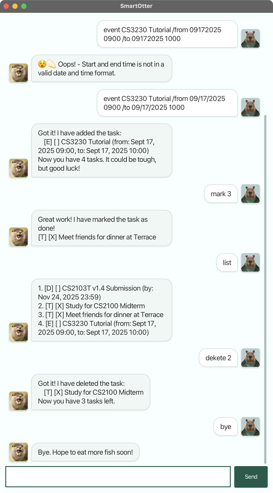

# SmartOtter User Guide

Meet SmartOtter 🦦, your friendly and playful personal assistant that helps you manage tasks with ease. Sometimes, it may
ask you to give it some fish as a reward. However, feel free to give any other seafood since the otter is smart and
loves other kinds of food as well.



## Prerequisites

1. Ensure you have Java version 17 installed on your local device. Verify this by running `java -version`.
2. Install the latest release from [here](https://github.com/oadultradeepfield/ip/releases/). This step ensures you get
   the latest available version which has great UX and is bug-free!

## Features

Once you have everything ready, you can navigate to the directory that contains `smart_otter.jar` and then use:

```bash
java -jar smart_otter.jar
```

This command will start the application. You should see a greeting message from SmartOtter. To quit the application,
simply type `bye`. SmartOtter will give you a farewell message before closing the application automatically. Note that
this process is the same as closing the application manually.

### Creating Tasks

SmartOtter can handle 3 types of tasks: to-do, tasks with deadlines, and event tasks. To add each type of task, use the
following:

```txt
todo <task_name>
deadline <task_name> /by <date or datetime>
event <task_name> /from <date or datetime> /to <date or datetime>
```

Note that `<date>` is in the format `MM/DD/YYYY`, for example `12/25/2025`. The format `<datetime>` extends this further
by adding time in `HHMM` format, e.g., `12/25/2025 1800`.

Don't worry if you type it incorrectly—SmartOtter will inform you if it doesn't align with the above format.

### Finding Tasks

SmartOtter allows you to find tasks in the following three ways:

1. `list`: Find all tasks.
2. `find <keyword>`: Find tasks that match the given keywords in their description, i.e., supports search by date
   string.
3. `today`: Find all deadline and event tasks that overlap with today.

### Editing Tasks

Although SmartOtter doesn't support editing task information directly, you can still delete the task using
`delete <task number>` and create a new one.

Note that `<task_number>` is the **number displayed by the `list` command**. Using the number shown from `find` or
`today` may give you incorrect deletion results.

Additionally, all tasks are created with a status of _not done_. You can mark them as _done_ or _not done_ using the
following commands:

```txt
mark <task_number>
unmark <task_number>
```

Note that `<task_number>` follows the same constraint as in deletion.

### Typo Autocorrection

SmartOtter is smart, as its name suggests. If you make a typo in the command, e.g., `dekete` instead of `delete`, it
will still recognize what you mean. This feature is very flexible, since it allows at most two characters to be
incorrect. For instance, using `test` is still recognized as `list` since it differs by only `te` and `li`. Normally,
this should not cause confusion between similar commands, but be aware that it might be wrong sometimes, so maintain
consistency in your typing.